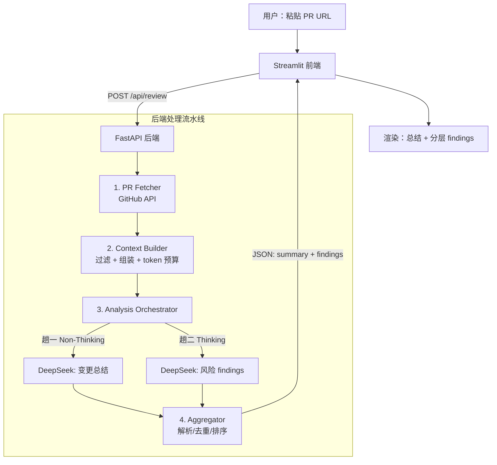

# AI PR Review 助手 — MVP 开发文档

> 目标：3 天内借助 AI coding 完成一个可演示的最小可用版本。用户粘贴一个公开 GitHub PR 链接，系统自动抓取变更、调用大模型分析，输出「变更总结 + 风险识别 + Review 建议」。
>
> 本文档可直接交给 AI coding 工具按模块逐步实现。

---

## 1. 项目概述与目标

### 1.1 要解决的问题
开发者在 Code Review 中耗时且容易遗漏问题。本工具用 AI 辅助：快速理解 PR 改了什么、自动标出高风险代码、给出可操作的修改建议，降低 Review 成本、提升一致性。

### 1.2 MVP 范围（做什么）
- 输入一个**公开** GitHub PR URL。
- 自动抓取 PR 元信息、变更文件列表、diff、变更文件全文。
- 调用 DeepSeek V4 产出：
  1. **PR 变更总结**（这个 PR 做了什么 / 影响哪些模块）。
  2. **风险代码识别 + Review 建议**（结构化 findings：文件、行号、类别、严重度、置信度、建议）。
- Streamlit 页面展示结果，findings 按 严重度 × 置信度 分层。

### 1.3 MVP 不做什么（明确边界，避免范围蔓延）
- 不做 GitHub App / webhook 自动触发，不回写 PR 行内评论。
- 不支持私有仓库 OAuth（可选支持 token 仅用于提升限流，见 §7.3）。
- 不做全仓 RAG / 跨文件符号解析（上下文锁定 Level 1）。
- 不做用户系统、持久化数据库（结果存内存 / 可选本地缓存）。

---

## 2. 技术选型（已锁定）

| 层 | 选型 | 说明 |
|---|---|---|
| 后端 | Python 3.11+ / FastAPI | 提供 REST API |
| 前端 | Streamlit | 简单演示界面，作为后端的瘦客户端 |
| 大模型 | DeepSeek `deepseek-v4-pro` | OpenAI 兼容接口，1M 上下文，双模式（Thinking / Non-Thinking） |
| 模型 SDK | `openai` Python SDK | 仅改 `base_url` 即可，无需 DeepSeek 专用 SDK |
| HTTP 客户端 | `httpx` | 调 GitHub API |
| 数据校验 | `pydantic` v2 | 请求/响应/Finding 数据结构 |

**关键参数（来自 DeepSeek 官方）**
- `base_url`: `https://api.deepseek.com`
- `model`: `deepseek-v4-pro`（1.6T 总参数 / 49B 激活，1M 上下文，最大输出 384K）
- 兼容 OpenAI ChatCompletions；Thinking / Non-Thinking 通过参数切换。

> 注意：旧别名 `deepseek-chat` / `deepseek-reasoner` 将于 2026-07-24 退役，本项目一律使用 `deepseek-v4-pro`。

---

## 3. 系统架构



### 处理流水线（顺序）
1. 解析 PR URL → `(owner, repo, pull_number)`。
2. **PR Fetcher**：取元信息、变更文件（含 `patch`/diff）、变更文件全文。
3. **Context Builder**：过滤噪音文件、按规则裁剪、估算并控制 token 预算，组装成模型输入。
4. **Analysis Orchestrator**：
   - 趟一（Non-Thinking）→ 变更总结。
   - 趟二（Thinking）→ 结构化 findings（含 prompt 内自检约束）。
5. **Aggregator**：解析 JSON、字段校验、去重、按 (severity, confidence) 排序。
6. 返回前端渲染。

---

## 4. 项目目录结构

```
ai-pr-review/
├── backend/
│   ├── main.py                # FastAPI 入口与路由
│   ├── config.py              # 环境变量与常量
│   ├── models.py              # pydantic 数据结构
│   ├── github_client.py       # PR Fetcher
│   ├── context_builder.py     # 上下文构建 + token 预算
│   ├── llm_client.py          # DeepSeek 调用封装（两种模式）
│   ├── orchestrator.py        # 两趟分析编排
│   ├── prompts.py             # 两趟 prompt 模板
│   └── aggregator.py          # findings 解析/去重/排序
├── frontend/
│   └── app.py                 # Streamlit 客户端
├── requirements.txt
├── .env.example
└── README.md
```

---

## 5. 数据结构（pydantic / JSON Schema）

### 5.1 分析请求
```python
class ReviewRequest(BaseModel):
    pr_url: str                      # https://github.com/{owner}/{repo}/pull/{n}
    thinking_findings: bool = True   # 风险趟是否开 Thinking（默认开）
    max_files: int = 80              # 文件数硬上限
    max_input_tokens: int = 300_000  # 输入 token 软预算（成本控制）
```

### 5.2 Finding（核心结构）
```python
class Finding(BaseModel):
    file: str
    line_start: int | None           # 相对该文件新版本的行号；解析不到则 None
    line_end: int | None
    category: Literal["logic", "security", "performance",
                      "maintainability", "edge_case", "style", "test"]
    severity: Literal["high", "medium", "low"]
    confidence: Literal["high", "medium", "low"]
    title: str                       # 一句话标题
    description: str                 # 问题说明（为什么是问题）
    suggestion: str                  # 可操作的修改建议
    code_snippet: str | None = None  # 相关代码片段（可选）
```

### 5.3 分析响应
```python
class FileMeta(BaseModel):
    filename: str
    status: str                      # added/modified/removed/renamed
    additions: int
    deletions: int
    included_full_content: bool      # 是否带了全文（被裁剪则 False）

class ReviewResponse(BaseModel):
    pr_title: str
    pr_author: str
    summary: str                     # PR 变更总结（markdown 文本）
    findings: list[Finding]
    files: list[FileMeta]
    stats: dict                      # {total_files, analyzed_files, skipped_files,
                                     #  est_input_tokens, model, elapsed_sec}
    warnings: list[str] = []         # 例如「PR 过大已截断」
```

### 5.4 findings JSON Schema（模型必须严格输出此结构）
```json
{
  "findings": [
    {
      "file": "string",
      "line_start": 0,
      "line_end": 0,
      "category": "logic|security|performance|maintainability|edge_case|style|test",
      "severity": "high|medium|low",
      "confidence": "high|medium|low",
      "title": "string",
      "description": "string",
      "suggestion": "string",
      "code_snippet": "string (optional)"
    }
  ]
}
```

---

## 6. GitHub API 调用清单（PR Fetcher）

Base：`https://api.github.com`，Header：`Accept: application/vnd.github+json`（可选带 `Authorization: Bearer <GITHUB_TOKEN>` 提升限流）。

| 用途 | 方法与路径 | 取的字段 |
|---|---|---|
| PR 元信息 | `GET /repos/{owner}/{repo}/pulls/{n}` | `title`, `body`, `user.login`, `base.sha`, `head.sha`, `changed_files` |
| 变更文件列表（含 diff） | `GET /repos/{owner}/{repo}/pulls/{n}/files?per_page=100&page=k` | 每项：`filename`, `status`, `additions`, `deletions`, `changes`, `patch`, `sha`, `contents_url` |
| 文件全文 | `GET /repos/{owner}/{repo}/contents/{path}?ref={head.sha}` | `content`(base64), `encoding` |

**实现要点**
- `/files` 分页：每页最多 100，需循环翻页直到取完（或到 `max_files` 上限）。GitHub 单 PR 文件列表最多返回 3000 个。
- `patch` 字段即该文件的 unified diff，**无需另调 diff 接口**。某些超大文件 GitHub 不返回 `patch`（标记为过大），此时仅记录元信息、跳过全文。
- 全文用 contents API，`ref` 取 `head.sha` 保证拿到 PR 版本；`status == "removed"` 的文件不取全文。
- URL 解析正则：`github\.com/([^/]+)/([^/]+)/pull/(\d+)`。
- 限流：匿名 60 次/小时；带 token 5000 次/小时。建议 `.env` 可选配 `GITHUB_TOKEN`，仅作提速用，不强制。
- 错误处理：404（PR 不存在/私有）、403（限流）需返回清晰提示给前端。

---

## 7. 上下文构建策略（Level 1）

### 7.1 原则
默认给模型「**每个变更文件的 diff + 该文件的完整新版本内容**」，让模型在 diff 之外也能看到上下文，显著压低误报。

### 7.2 过滤与裁剪规则（按顺序）
1. **跳过整类噪音文件**（仅可选保留 diff，不取全文）：
   - 锁文件：`package-lock.json`, `yarn.lock`, `pnpm-lock.yaml`, `poetry.lock`, `go.sum`, `Cargo.lock`, `composer.lock`
   - 生成/压缩产物：`*.min.js`, `*.map`, `dist/`, `build/`, `vendor/`, `node_modules/`
   - 二进制：图片、字体、`*.pdf`, `*.zip` 等（按扩展名判断）
2. **删除的文件**：只保留元信息，不取全文。
3. **超大文件全文裁剪**：单文件超过 `MAX_FILE_LINES`（建议 1500 行）则只保留 diff hunk 及其上下各 ~40 行，置 `included_full_content=False`。
4. **文件数上限**：超过 `max_files`（默认 80）后只保留 diff、不取全文，并在 `warnings` 标注。
5. **token 软预算**：边组装边用 `len(text)//4` 粗估 token，累计超过 `max_input_tokens`（默认 300K，远低于 1M 上限，纯为控成本）后停止追加全文，仅保留 diff，并记入 `warnings`。

### 7.3 输入组装格式（喂给模型的文本结构）
```
# PR 标题: {title}
# PR 描述: {body}

## 变更文件 1: {filename} ({status}, +{add}/-{del})
### Diff
```diff
{patch}
```
### 文件完整内容（新版本）
```{lang}
{full_content}
```

## 变更文件 2: ...
```

---

## 8. 大模型调用（DeepSeek V4）

### 8.1 客户端封装（`llm_client.py`）
用 OpenAI SDK，仅改 `base_url`：
```python
from openai import OpenAI
client = OpenAI(api_key=DEEPSEEK_API_KEY, base_url="https://api.deepseek.com")

def call(messages, thinking: bool, json_mode: bool = False):
    kwargs = {
        "model": "deepseek-v4-pro",
        "messages": messages,
        "temperature": 0.2 if not thinking else 1.0,  # 见注
    }
    # Thinking 模式的开启方式以 DeepSeek 官方 thinking_mode 文档为准，
    # 实现时按官方参数名设置（如 reasoning effort / thinking 开关）。
    if json_mode:
        kwargs["response_format"] = {"type": "json_object"}
    return client.chat.completions.create(**kwargs)
```
> 实现注意：Thinking 模式的具体参数名/取值以 DeepSeek 官方 `thinking_mode` 文档为准（AI coding 时按当前文档填）。总结趟用 Non-Thinking，风险趟用 Thinking。

### 8.2 两趟编排（`orchestrator.py`）
- **趟一 · 变更总结**：Non-Thinking，输入 = 组装好的上下文，输出 = markdown 总结文本。
- **趟二 · 风险 findings**：Thinking + `json_object` 模式，输入 = 同一份上下文，输出 = §5.4 的 JSON。
- 两趟可顺序执行（简单），也可用 `asyncio` 并发（更快，推荐）。

---

## 9. 误报 / 漏报控制

- **结构化 + 置信度**：每条 finding 必带 `confidence`，前端低置信度折叠或标「仅供参考」，不与高危混排。
- **Prompt 内自检（不单独调用）**：风险趟 prompt 明确要求模型「逐条复核：该问题是否真实成立、是否已被上下文别处处理；不确定就不报或标 low confidence」。
- **行号要求**：要求模型尽量给出具体行号引用，逼它定位到真实代码而非泛泛而谈。
- **分类清单**：固定 7 类（logic/security/performance/maintainability/edge_case/style/test），约束模型只在这些维度报告。
- 漏报：MVP 不追求覆盖率，靠「全文上下文 + 明确分类」缓解，列为后续优化项。

---

## 10. Prompt 模板（`prompts.py`）

### 10.1 趟一 · 变更总结（System）
```
你是资深代码评审专家。请阅读给定 GitHub PR 的标题、描述、各文件 diff 与完整内容，
用中文输出一份简洁的变更总结，包含：
1) 这个 PR 做了什么（1-3 句概述）
2) 主要改动点（按文件或模块分条）
3) 是否涉及架构/接口/依赖变动
4) 潜在影响范围
不要逐行复述代码，聚焦"意图与影响"。输出 Markdown。
```

### 10.2 趟二 · 风险识别（System）
```
你是严谨的代码评审专家。基于给定 PR 的 diff 与文件完整内容，找出值得 reviewer 关注的问题。

只在以下 7 个维度报告：logic（逻辑错误）、security（安全）、performance（性能）、
maintainability（可维护性）、edge_case（边界/异常）、style（风格规范）、test（测试缺失）。

严格要求：
- 每条问题必须能定位到具体文件与行号（依据新版本文件内容）。
- 逐条自检：该问题是否真实成立？是否已在上下文别处被处理？若不确定，请不报，或将 confidence 设为 low。
- 不要报告 diff 之外、本 PR 未触及的既有问题。
- 宁缺毋滥：没有把握的不要编造。

仅输出 JSON 对象，结构如下（不要任何额外文字、不要 Markdown 代码块包裹）：
{"findings":[{"file","line_start","line_end","category","severity","confidence","title","description","suggestion","code_snippet"}]}
severity 取 high/medium/low；confidence 取 high/medium/low。
若无问题，返回 {"findings":[]}。
```

### 10.3 User 消息
两趟的 User 消息都为 §7.3 组装好的上下文文本。

---

## 11. 后端 API 设计（FastAPI）

| 端点 | 方法 | 请求 | 响应 |
|---|---|---|---|
| `/api/health` | GET | — | `{"status":"ok"}` |
| `/api/review` | POST | `ReviewRequest` | `ReviewResponse` |

- `/api/review` 为同步阻塞调用（MVP 够用）。前端展示 loading；注意单次可能耗时数十秒，确保前端/服务端超时设足够长（建议 180s）。
- 统一异常处理：GitHub 404/403、URL 解析失败、模型返回非法 JSON（趟二做一次「解析失败则重试一次 / 降级为空 findings + warning」）。
- CORS：允许 Streamlit 本地来源。

---

## 12. 前端设计（Streamlit `app.py`）

- 顶部：标题 + PR URL 输入框 + 「开始评审」按钮 + 高级选项（max_files、是否 Thinking，折叠）。
- 点击后 `requests.post` 调 `/api/review`，`st.spinner` 显示进度。
- 结果区：
  1. **PR 信息**：标题、作者、文件数统计、模型、耗时、warnings。
  2. **变更总结**：`st.markdown(summary)`。
  3. **风险 findings**：先按 severity 分组（high→medium→low）；每组内 high confidence 直接展开、low confidence 用 `st.expander` 折叠。每条卡片显示：`[category][severity·confidence] title` / 文件:行号 / description / suggestion / 可选 code_snippet。
- 用颜色/emoji 区分严重度（🔴 high / 🟠 medium / ⚪ low），提升可读性。

> 简化选项：因前后端同为 Python，演示时也可让 Streamlit 直接 import 后端流水线函数、跳过 HTTP。建议仍保留 FastAPI 以体现清晰分层；时间紧时再走直连捷径。

---

## 13. 配置与环境变量（`.env.example`）

```
DEEPSEEK_API_KEY=sk-xxxx
DEEPSEEK_BASE_URL=https://api.deepseek.com
DEEPSEEK_MODEL=deepseek-v4-pro
GITHUB_TOKEN=                # 可选，仅用于提升限流
BACKEND_URL=http://localhost:8000
MAX_FILES=80
MAX_FILE_LINES=1500
MAX_INPUT_TOKENS=300000
REQUEST_TIMEOUT_SEC=180
```

`requirements.txt`
```
fastapi
uvicorn[standard]
streamlit
openai
httpx
pydantic>=2
python-dotenv
requests
```

启动：后端 `uvicorn backend.main:app --reload`；前端 `streamlit run frontend/app.py`。

---

## 14. 三天任务拆解

### Day 1 — 数据通路打通（后端骨架）
- [ ] 初始化项目结构、`requirements.txt`、`.env`、`config.py`。
- [ ] `models.py`：定义 `ReviewRequest` / `Finding` / `ReviewResponse` 等。
- [ ] `github_client.py`：URL 解析、取元信息、取文件列表（分页）、取文件全文、错误处理。
- [ ] 写个临时脚本对某个真实公开 PR 跑通抓取，打印结构。
- **验收**：给定 PR URL 能拿到完整 diff + 全文 + 元信息。

### Day 2 — 分析核心（上下文 + 模型 + 编排）
- [ ] `context_builder.py`：过滤规则、裁剪、token 预算、组装输入文本。
- [ ] `llm_client.py`：DeepSeek 封装（Non-Thinking / Thinking、json_object）。
- [ ] `prompts.py`：两趟 prompt。
- [ ] `orchestrator.py`：两趟编排（并发）。
- [ ] `aggregator.py`：解析 findings JSON、字段校验、去重、按 (severity, confidence) 排序；非法 JSON 重试一次。
- [ ] `main.py`：接好 `/api/review`，端到端跑通返回 `ReviewResponse`。
- **验收**：POST 一个 PR URL，返回总结 + 结构化 findings。

### Day 3 — 前端 + 打磨 + 演示
- [ ] `frontend/app.py`：输入、调用、loading、分层渲染。
- [ ] 误报观感调优：调 prompt、确认低置信度折叠生效。
- [ ] 边界测试：超大 PR（截断 warning）、纯文档 PR、含 lock 文件 PR、私有/不存在 PR 的报错提示。
- [ ] `README.md`：安装与运行说明。
- [ ] 准备 2-3 个演示用公开 PR。
- **验收**：粘贴 URL → 完整可读报告，演示流畅。

---

## 15. 未来扩展方向（写入文档、MVP 不实现）

- **GitHub App + webhook**：PR 打开/更新自动触发，结果回写为行内评论。
- **上下文 Level 2/3**：顺 import/调用关系拉关联文件；大仓库做 embedding RAG 检索。
- **模型分层路由**：便宜模型（v4-flash）做总结/triage，强模型（v4-pro）做深度 review。
- **反馈学习**：记录建议被采纳/忽略，用于调权重与 prompt。
- **团队规范注入**：把项目风格指南/编码规范作为额外上下文。
- **多平台**：GitLab / Bitbucket。
- **CI 集成**：作为流水线步骤，risk 超阈值时阻断合并。
- **流式输出**：SSE 流式返回 findings，改善长 PR 等待体验。

---

## 16. 风险与注意事项

- **DeepSeek Thinking 模式参数**：以官方 `thinking_mode` 文档为准，实现时核对当前参数名。
- **模型返回非法 JSON**：趟二必须有容错（重试 + 降级），否则整次请求失败。
- **GitHub 限流**：匿名 60/h，演示前确认或配 `GITHUB_TOKEN`。
- **长耗时**：v4-pro + Thinking + 大 PR 可能数十秒，前后端超时都要放宽。
- **成本**：虽有 1M 上下文，仍以 `MAX_INPUT_TOKENS` 软预算控成本，别无脑塞满。
- **范围控制**：严格遵守 §1.3 边界，3 天内不碰 webhook / RAG / 私有仓库 OAuth。
